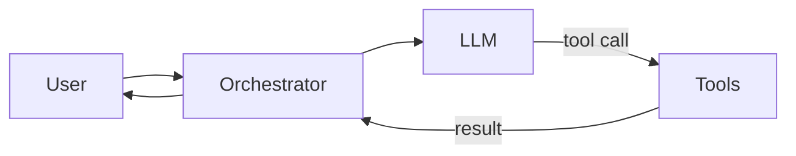

# AI Agents — A Practical Guide for Web Developers

"AI agents" became a buzzword overnight. Strip the hype and you get something useful: **software that plans, calls tools, and iterates toward a goal** — not just a single prompt/response.

As a full stack developer exploring AI workflows alongside CMS and editorial work, here is how I think about agents practically.

## Agent vs chatbot vs automation

| Type | Behavior | Example |
|------|----------|---------|
| Chatbot | Single turn or short context Q&A | FAQ widget on a clinic site |
| Automation | Fixed if-this-then-that script | Webhook → Slack notification |
| Agent | Plans steps, uses tools, loops until done | Research assistant that searches, reads, summarizes |

Agents add value when the **path to the answer is not known upfront**.

## Core components

Every agent system has four pieces:

1. **LLM** — reasoning engine (GPT-4o, Claude, Gemini, local models)
2. **Tools** — functions the agent can call (search, database query, send email, update CMS)
3. **Memory** — conversation history, vector store, or structured state
4. **Orchestrator** — loop that decides: think → act → observe → repeat



## When agents make sense for web products

**Good fits:**

- Internal admin assistants ("draft a news summary from these three URLs")
- Content migration helpers (parse legacy HTML → Payload blocks)
- Support triage (classify ticket → route → draft reply)
- Code review bots on PRs

**Poor fits:**

- Replacing a contact form with an agent
- Real-time sub-100ms interactions
- Tasks with zero tolerance for hallucination and no human review

## A minimal agent loop in TypeScript

```ts
async function runAgent(goal: string, tools: Tool[]) {
  const messages = [{ role: 'user', content: goal }]

  for (let step = 0; step < 10; step++) {
    const response = await llm.chat({ messages, tools })

    if (!response.toolCalls?.length) {
      return response.content // done
    }

    for (const call of response.toolCalls) {
      const result = await executeTool(call.name, call.args)
      messages.push({ role: 'tool', content: JSON.stringify(result) })
    }
  }
}
```

Frameworks like LangChain, Vercel AI SDK, and LangGraph wrap this loop with better state management.

## Guardrails that matter in production

1. **Max iterations** — prevent infinite loops and runaway API costs
2. **Tool allowlists** — agents only call approved functions
3. **Human-in-the-loop** — require approval before publish, send, or delete
4. **Logging** — store every tool call and LLM response for audit
5. **Cost caps** — set per-user and per-day token limits

## Agents + CMS

The intersection I find most interesting: **agents that operate on structured CMS content**.

Example workflow:

1. Editor drops a press release PDF in admin
2. Agent extracts text, suggests Payload blocks (headline, quote, gallery)
3. Editor reviews and publishes — no developer in the loop

This keeps humans in control while removing repetitive formatting work.

## What I am exploring now

- RAG over project documentation and CMS style guides
- LangChain pipelines for content summarization
- Agent-assisted code generation for Payload collection schemas

I document experiments on this blog as they graduate from prototype to production pattern.

---

**Related:** [LangChain for Developers](https://arjunvaradiyil.in/blog/langchain-for-developers) · [Payload CMS Tutorial](https://arjunvaradiyil.in/blog/payload-cms-tutorial)

**Connect:** [LinkedIn](https://www.linkedin.com/in/arjunvaradiyil) · [Contact](https://arjunvaradiyil.in/contact)
