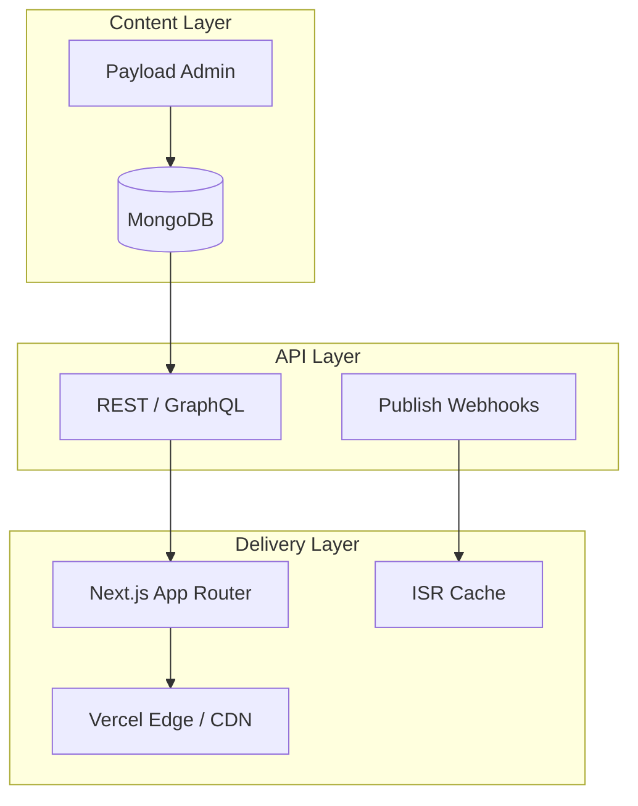

# Headless CMS Architecture — Patterns for Scalable Content Platforms

A headless CMS separates **content management** from **content delivery**. Editors work in an admin UI; developers fetch structured content via API and render it in Next.js, mobile apps, or email templates.

I have shipped this architecture on news portals, festival sites, civic platforms, and my own portfolio. Here is the blueprint.

## The three layers



## Content modeling principles

### 1. Model for editors, not developers

Field names should match editorial language: `headline`, `dek`, `byline` — not `field_1`, `text_block_a`.

### 2. Blocks over page templates

Instead of 15 page templates, define 8–12 reusable blocks:

- Hero
- Rich text
- Image gallery
- Embed (video, tweet, map)
- Related content rail
- CTA banner

Editors compose pages; developers map blocks to React components.

### 3. Relationships over duplication

Reference `authors`, `categories`, and `media` by ID. Update once, reflect everywhere.

### 4. Versioning and drafts

Use `_status: draft | published` with `publishedAt`. Never show drafts on the public site:

```ts
await payload.find({
  collection: 'articles',
  where: { _status: { equals: 'published' } },
})
```

## API layer decisions

| Approach | Pros | Cons |
|----------|------|------|
| REST | Simple, cacheable | Over-fetching without discipline |
| GraphQL | Precise queries | Complexity, caching harder |
| Direct DB (Payload local API) | Fastest in Next.js SSR | Tied to Node runtime |

On Next.js + Payload, I use the **local API** in Server Components — no HTTP hop:

```ts
const payload = await getPayload({ config })
const article = await payload.findByID({ collection: 'articles', id })
```

For mobile or third-party consumers, expose REST or GraphQL from the same Payload instance.

## Caching strategy

| Content type | Strategy |
|--------------|----------|
| Homepage / listings | ISR `revalidate: 60` |
| Article detail | ISR + on-demand revalidation on publish |
| Static pages (about, contact) | SSG at build time |
| Preview / draft | SSR with auth, `cache: 'no-store'` |

On-demand revalidation webhook from Payload:

```ts
// payload hook afterChange
if (doc._status === 'published') {
  await fetch(`${SITE_URL}/api/revalidate?secret=${SECRET}&path=/articles/${doc.slug}`)
}
```

## Media architecture

Store files in **S3** (or R2), not on the app server:

- Client-side uploads for Vercel compatibility
- `next/image` for responsive delivery with AVIF/WebP
- CDN in front of S3 for global read performance

## Multi-channel delivery

The same `articles` collection can power:

- Next.js reader site
- RSS feed (`/rss.xml`)
- Email newsletter (fetch API → Resend template)
- Mobile app (GraphQL endpoint)

Structure content once; render everywhere.

## Security

- Admin at `/admin` — restrict by IP or SSO in production
- API keys for webhooks — rotate regularly
- Field-level access control in Payload (`access.read`, `access.update`)
- Never expose `PAYLOAD_SECRET` or `DATABASE_URI` to the client

## Static fallback for reliability

Hybrid architecture I use on every CMS project:

```
Try Payload → on failure → static data in src/data/
```

CI builds without MongoDB. Local dev works offline. Production uses live CMS. One codebase, three modes.

## Real-world examples

| Project | CMS role |
|---------|----------|
| [Prajasakti](https://prajasakti.com/) | Daily Telugu news publishing |
| [Kochi Muziris Biennale](https://www.kochimuzirisbiennale.org/) | Festival programme content |
| [arjunvaradiyil.in](https://arjunvaradiyil.in) | Portfolio projects, skills, site settings |

---

**Related:** [Payload CMS Tutorial](https://arjunvaradiyil.in/blog/payload-cms-tutorial) · [Payload Collections for Newsrooms](https://arjunvaradiyil.in/blog/payload-cms-collections-for-newsroom-workflows) · [MongoDB Performance](https://arjunvaradiyil.in/blog/mongodb-performance-tips)

**Connect:** [LinkedIn](https://www.linkedin.com/in/arjunvaradiyil) · [Contact](https://arjunvaradiyil.in/contact)
